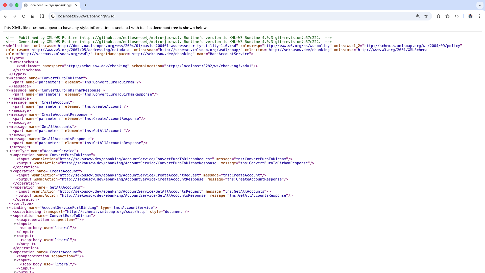
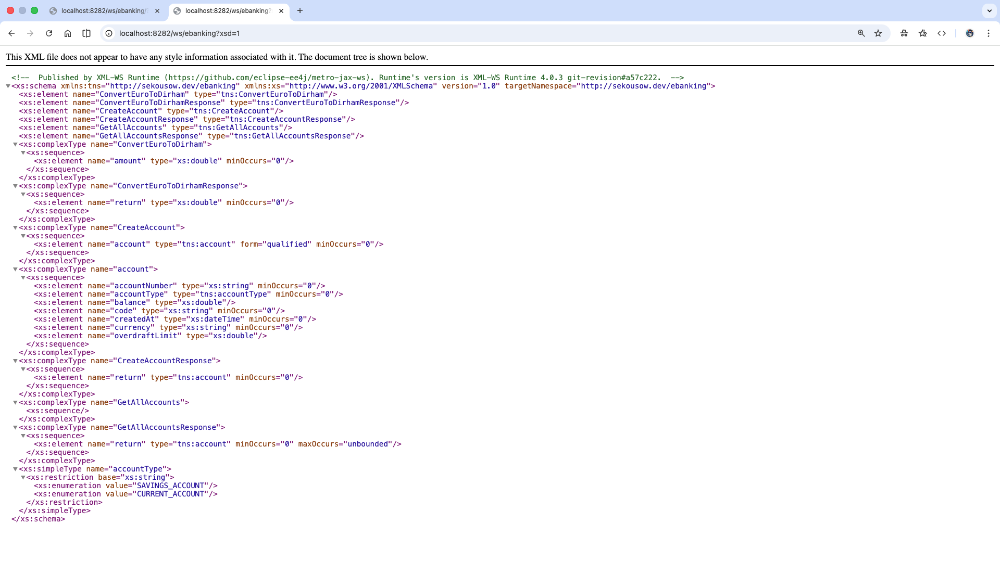
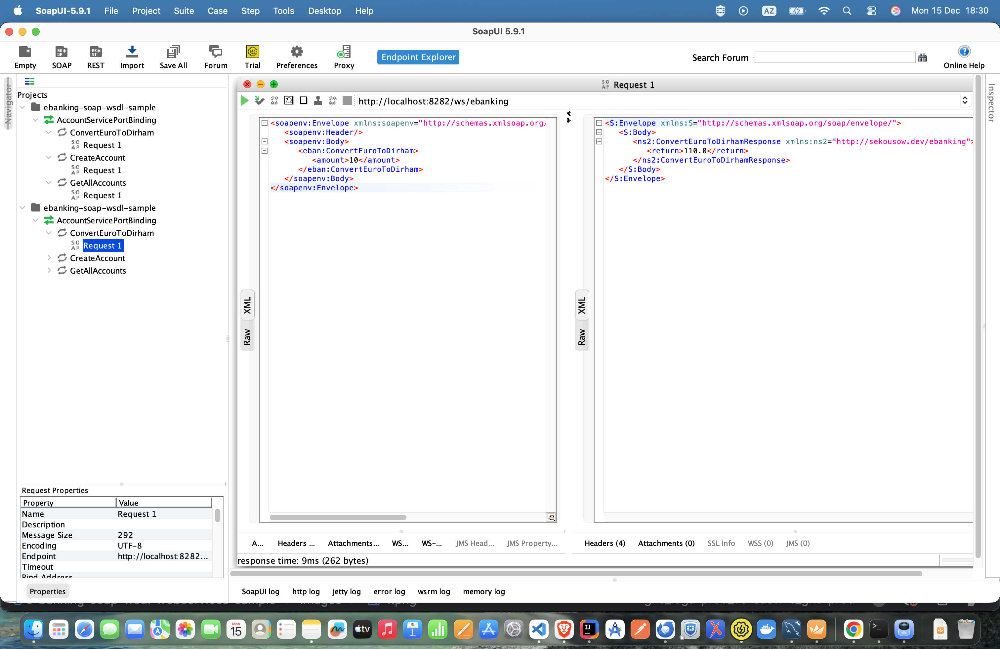
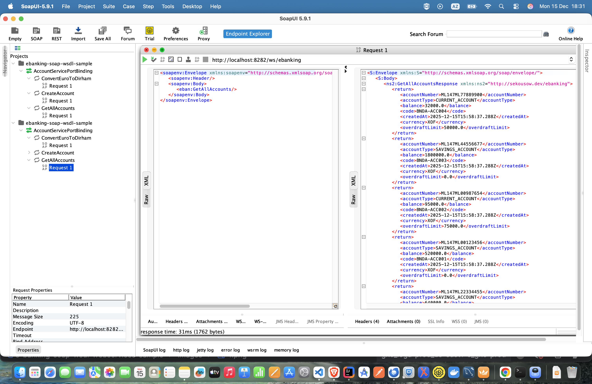
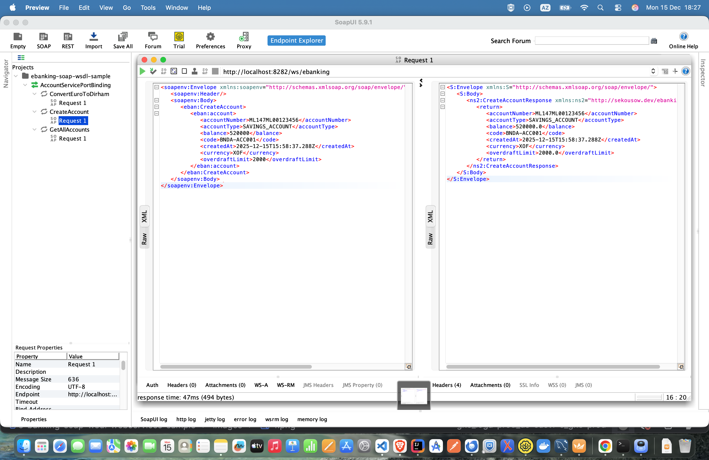

# E-Banking SOAP Web Service – Demo Project

Ce projet est une démonstration d’un **Web Service SOAP en Java** simulant un système bancaire simple.
Il illustre **l’implémentation (producteur)** et **la consommation (client)** de services SOAP (**JAX-WS**) dans une *
*architecture multi-modules Maven**, sans framework applicatif tel que Spring Boot.

---

## Fonctionnalités

Le système bancaire simulé expose les opérations suivantes :

* Création de comptes bancaires
* Consultation de la liste des comptes
* Conversion Euro vers Dirham
* Exposition d’un Web Service SOAP via un serveur applicatif

---

## Architecture du projet

Le projet est structuré sous forme d’un **repository Maven multi-modules**, séparant clairement les responsabilités
entre le **serveur SOAP** et le **client SOAP**.

```
e-banking-soap-wsdl-webservices-sample
│
├── e-banking-server
│   ├── src/main/java
│   ├── src/main/resources
│   ├── src/main/webapp
│   └── pom.xml
│
└── e-banking-client
    ├── src/main/java
    ├── src/main/resources
    └── pom.xml
```

### Rôle des modules

#### `e-banking-server` — Producteur SOAP

* Implémente les **services SOAP** avec **JAX-WS**
* Expose automatiquement le **WSDL** et les **XSD**

#### `e-banking-client` — Consommateur SOAP

* Consomme le Web Service SOAP exposé par le serveur
* Génère les **stubs clients** à partir du WSDL (`wsimport` ou plugin Maven)
* Appelle les opérations SOAP comme de simples méthodes Java

---

## Technologies utilisées

* Java 21
* Maven
* JAX-WS (SOAP)
* WSDL / XSD
* WSImport / Plugin Maven JAX-WS

---

## Démarrage de l’application

### Prérequis

* Java 21
* Maven 3.x
* Serveur applicatif compatible JAX-WS

### Lancer le serveur SOAP

```bash
cd e-banking-server
mvn clean package
```
---

## Accès au Web Service

### WSDL

```
http://localhost:8282/ws/ebanking/?wsdl
```

Capture du WSDL exposé par le serveur :



---

### XSD

```
http://localhost:8282/ws/ebanking?xsd=1
```

Schéma XSD exposé par le Web Service :



---

## Tests du Web Service avec SOAP UI

Le Web Service SOAP est testé via **SOAP UI** en important le WSDL.

```
http://localhost:8282/ws/ebanking/?wsdl
```

SOAP UI génère automatiquement les requêtes correspondant aux opérations exposées.

---

### Conversion Euro vers Dirham



---

### Récupération des comptes



---

### Création d’un compte bancaire



---

## Consommation du Web Service

Le module `e-banking-client` consomme le Web Service exposé par le serveur en important le WSDL.

### Génération des classes clientes

```bash
wsimport -keep -p com.example.client \
http://localhost:8282/ws/ebanking/?wsdl
```

---

## Organisation des ressources

```
images/
├── ebanking-wsdl.png
├── ebanking.xsd.png
├── 1.png
├── 2.png
└── 3.png
```

---

## Notes

Ce projet est destiné à un usage **éducatif et démonstratif**.
Il ne couvre pas les aspects avancés tels que la sécurité SOAP (WS-Security), la gestion des transactions ou la montée
en charge.

---
